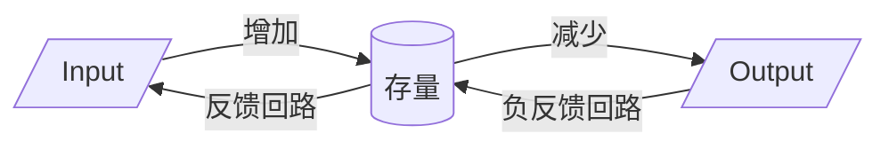

《系统之美》（Thinking in Systems）是Donella H. Meadows关于系统思维的经典著作，帮助读者理解复杂系统的结构、行为和应对方法。

## 目录

- 核心概念
- 重要术语表
- 章节要点归纳
- 关键图表与模型
- 常见系统陷阱与对策
- 采取干预措施的杠杆点
- 个人思考与应用
- 参考资料

---

## 核心概念

- **系统**：由相互关联的部分组成的整体。
- **要素（Elements）**：系统的组成部分。
- **反馈回路（Feedback Loops）**：系统中输出反过来影响输入的机制。
- **库存与流量（Stocks & Flows）**：系统中的积累与变化。
- **延迟（Delays）**：输入与输出之间的时间差。
- **杠杆点（Leverage Points）**：影响系统行为的关键位置。

---

### 重要术语表

| 英文                  | 中文     | 释义                                                        |
|---------------------|--------|-----------------------------------------------------------|
| System              | 系统     | 由相互关联的部分组成的整体，具有特定功能和目标。                                  |
| Archetype           | 系统基模   | 常见的系统结构，能够产生特定的行为模式                                       |
| Element             | 要素     | 系统中的基本组成部分。                                               |
| Feedback Loop       | 反馈回路   | 通过影响流入或流出量二十存量发生改变的机制，分为正反馈和负反馈。                          |
| Bounded rationality | 有限理性   | 从一个系统的部分来看，做出决策或行动是合理的，但从系统整体或更大的层面上看，这些逻辑就不合理。           |
| Stock & Flow        | 库存与流量  | 库存是系统的积累，流量是库存的变化速率。                                      |
| Delay               | 延迟     | 输入与输出之间的时间差，影响系统反应速度。                                     |
| Leverage Point      | 杠杆点    | 能有效改变系统行为的关键位置。                                           |
| Boundary            | 边界     | 区分系统内部与外部的界限。                                             |
| Paradigm            | 范式     | 指导系统运���和思考的根本信念或模式。                                        |
| Resilience          | 适应力    | 指导系统从扰动中恢复到稳定状态的能力。                                       |
| Self-organization   | 自组织    | 指导系统构建自身，产生新的结构，学习或多元化的能力。                                |
| Shifting dominance  | 主导地位转换 | 随着时间的推移，相互职能的反馈回路之间的相对力量强弱发生了改变。                          |
| Suboptimization     | 次优化    | 某个子系统的目标取代了系统整体的目标居于主导地位，到hi一种不合理的行为--系统以全部成本去实现某个子系统的目的。 |

---

## 章节要点归纳

### 第一部分 系统的结构和行为

- 系统由要素、相互作用和目标组成。
- 系统的结构决定其行为，行为决定结果。
- 系统边界的划定影响我们对系统的理解和干预。

只有通过分析系统的运作，我们才有可能明确地表述出系统的功能或目标。最好的方法就是仔细地观察一段时间，看看系统有哪些行为。
系统中最不明显的部分，即功能或目标，才是系统行为最关键的决定因素， 内在连接也是至关重要的，因为改变了要素之间的连接，通常会改变系统的行为

- **库存与流量**：库存是系统的积累，流量是库存的变化速率。
- **动态平衡**：系统通过反馈回路实现自我调节。
- **延迟效应**：系统的反应往往滞后于输入变化，易导致误判。

> "人类更容易关注存量而非流量，且倾向于关注流入量。要增加存量，可提高流入或减少流出。灌满浴缸并非只有一种方法。"

> "存量变化缓慢会导致时间滞后，既可能引发问题，也能稳定系统。"

> "调节回路的延迟可能引发振荡，缩短延迟时间可能加剧问题。"

- **正反馈**：自我增强，可能导致系统失控（如人口爆炸）。
- **负反馈**：自我调节，维持系统稳定（如体温调节）。
- 反馈回路的强弱和延迟决定系统的动态特性。

> "当存量的变化影响流入或流出时，形成反馈回路。"

> "反馈机制可能因信息延迟、不完整或行动无效而失效，导致系统无法达到期望状态。"

> "增强回路的翻倍时间约为70除以增长率（%），如7%年利率下10年翻倍（70/7=10）。"

> "调节回路需平衡流入与流出，否则反馈可能超出或低于目标值。"

> "增长系统中，增强回路驱动成长，调节回路限制成长，无系统可无限增长。"

### 第二部分 系统思考与我们

#### 系统三大特征
1. 适应力(自我修复能力)
   - 系统内部结构存在回路相互支撑，即使在系统遭受巨大的扰动时，仍然能使系统恢复至原有状态。
   - 适应力总是有限度的。 
   - 不能只是关注系统的生产率或稳定性，也要重视其适应力。

2. 自组织（细胞到组织）
   - 具有学习、多元化、复杂化和进化的能力,叫做自组织。
   - 自组织特性会产生出异质性和不可预测性，需要自由和试验，也需要一定程度的混乱

3. 层次性（套娃，官僚体制）
   - 系统和子系统的这种包含和生成关系，被称为层次性。
   - 子系统维系自身功能，同时服务于更大系统，而更大系统调节并强化子系统运作，保持稳定和效率。
   - 层次性原本的目的是帮助各个子系统更好地做好其工作

次优化
- 当某个子系统的目标而非整个系统的目标占了上风，并牺牲整个系统的运作成本去实现某个子系统的目标，我们将这样行为的结果称为“次优化“。
  团队成员过分追求个人荣誉，而忽视了团队整体的目标，团队就有可能失败；如果身体里一些细胞打破了该层次应有的功能，开始快速繁殖，就形成了癌症

#### 系统的6大障碍

### TODO
- **悲剧陷阱**：个体理性导致集体非理性（如公地悲剧）。
- **漂移陷阱**：目标标准随时间降低。
- **目标侵蚀**：短期目标取代长期目标。
- **应对策略**：识别陷阱、调整反馈、设定合适目标。

### 第六章：杠杆点——改变系统的有效切入点

- **杠杆点优先级**：范式 > 目标 > 结构 > 参数。
- **改变信息流**：提高透明度和反馈效率。
- **改变规则和目标**：系统行为的根本性改变。
- **范式转变**：最深层次的系统变革。

### 第七章：系统思维的实践

- **整体观念**：关注系统整体而非局部。
- **动态思维**：理解系统随时间的变化。
- **谦逊与学习**：承认不确定性，持续学习和调整。
- **小步试错**：逐步干预，观察反馈，避免大幅度调整带来的风险。

---

## 关键图表与模型

- **库存-流量图**：展示系统积累与变化。
- **反馈回路图**：正反馈与负反馈的示意。
- **系统陷阱示意图**：常见陷阱的结构与表现。

### 系统存量、流入、流出及反馈回路示意

---

## 常见系统陷阱与对策

* 政策阻力 
  - 陷阱：当系统中多个参与者有不同目标时，从而将系统存量往不同方向拉时，导致政策难以实施。
  - 对策：建立共识，或重新定义更大更重要的共同目标，增强政策透明度。
* 公地悲剧
    - 陷阱：个体追求自身利益导致公共资源过度消耗。
    - 对策：将资源私有化让参与者感受自己拿分滥用的后果，或建立有效的管理机制（如配额制）。
* 目标侵蚀
    - 陷阱：绩效标准受过去绩效影响，启动恶性循环，导致系统整体性能下降。
    - 对策：保持一个绝对的绩效标准，或将绩效标准设为过去最佳水平。
* 竞争升级
    - 陷阱：当系统一个存量状态取决于另外一个存量状态，并试图超过对方时，构成增强回路，如军备竞赛，贸易战。
    - 对策：避免陷入这一结构，或者单方面让步而切断回路或双方协商引入一些调节回路，对竞争进行限制。
* 富者愈富
    - 陷阱：竞争中的赢家会持续强化其进一步获胜的手段，形成增强回路，赢家通吃。
    - 对策：多元化，落败一方可进行另外一场博弈，反垄断法，引入再分配机制，如税收、社会保障等，或对胜利者给与多样化奖励，避免下一轮竞争中争夺同一有限资源。
* 转嫁负担
    - 陷阱：面对问题，采用的解决方案无助于解决根本问题，就会产生转嫁负担，依赖性和上瘾，麻痹感官把问题隐藏起来。
    - 对策：把关注点从短期的救济转移到长期的结构性重建上。
* 规避规则
    - 陷阱：上有政策，下有对策，虽然表面上遵行规则，但不符合规则的本意，扭曲了系统。
    - 对策：重新建立规则，从规避规则的行为中获得反馈，实现规则本来目的。
* 目标错位
    - 陷阱：系统行为对于反馈回路的目标特别敏感，如果目标定义不准确或不完整，结果不一定是想要的。
    - 对策：不要将努力和结果混淆，否则系统只产出特定的努力而不是期望的结果。
---

## 采取干预措施的杠杆点
- 数字： 各种常数和参数
- 缓冲器：比流量力量更大，更稳定的存量
- 存量-流量结构：实体系统及其交叉节点
- 时间延迟：系统反应的时间延迟
- 反馈回路：系统的正反馈和负反馈力量
- 增强回路：修正外界��响的反馈力量
- 信息流：系统中信息的流动和透明度
- 系统规则：激励、约束和规则
- 自组织：系统自我组织和适应的能力
- 范式：系统的核心信念和价值观

## 参考资料

- 《系统之美》原书
- 《第五项修炼》
- 系统思维相关课程与讲座
- [Donella Meadows Institute](https://donellameadows.org/)

### A. 关键补充知识点：深化系统思维理解
除了《系统之美》书中详述的核心概念，以下知识点将进一步提升你的系统化思维能力：
- 因果回路图 (Causal Loop Diagrams, CLDs)： 这是系统动力学中用于可视化反馈回路的强大工具。学习如何绘制CLD能帮助你更清晰地识别系统中的因果关系、增强型回路和平衡型回路，从而理解系统行为的动态性。
- 系统基模 (System Archetypes)： 梅多斯和其他系统思考者发现，许多复杂系统问题会呈现出反复出现的“模式”，被称为系统基模。了解这些常见的模式（如“饮鸩止渴”、“替罪羊”、“成长上限”、“公地悲剧”等）能帮助你更快地诊断问题，并找到更有效的干预点。
- 系统边界（System Boundaries）： 在分析系统时，确定系统的边界至关重要。不同的边界定义会影响你对系统内要素、连接和行为模式的理解，进而影响解决方案的有效性。
- 情景规划（Scenario Planning）： 基于系统思维，通过识别系统中的关键驱动因素和不确定性，构建不同的未来情景，从而提高组织对未来的适应性和韧性，避免“不作为的错误”。
- 模拟与建模（Simulation and Modeling）： 了解如何通过软件工具（如Stella, Vensim）对系统进行建模和模拟，可以帮助你测试不同干预措施的效果，预测系统行为，加深对系统动力学的理解。

### B. 主题阅读建议：围绕核心概念深化学习
为了更好地整合知识，建议您尝试“主题式阅读”，即围绕某个特定的系统思维概念，阅读多本书籍，从不同角度和学科去理解它。
* 主题：反馈回路与系统动态
 - 《系统之美》： （再次强调此书的第3章）打下反馈回路的基础。
 - 《第五项修炼》（The Fifth Discipline）： 彼得·圣吉（Peter Senge）著。此书是“学习型组织”的开创性著作，其中大量使用了系统动力学和反馈回路的概念来解释组织行为和学习障碍。它将系统思维与组织管理实践紧密结合。
 - 《思考快与慢》： 丹尼尔·卡尼曼（Daniel Kahneman）著。虽然是心理学著作，但书中对系统1”和“系统2”的描述，以及对各种认知偏差的分析，可以从行为反馈的角度来理解，从而深化你对“查理·芒格效应”的理解。
* 主题：杠杆点与有效干预
 - 《杠杆点：系统干预之地》（Leverage Points: Places to Intervene in a System）： 唐内拉·H·梅多斯（Donella H. Meadows）著。这实际上是梅多斯本人的一篇著名文章，详细阐述了12个干预系统的杠杆点。深入阅读这篇原文将极大地深化你对如何有效干预复杂系统的理解。
 - 《从0到1》（Zero to One）： 彼得·蒂尔（Peter Thiel）著。这本书虽然是关于创业的，但其核心思想——寻找垄断性优势，避免竞争，其实就是在商业系统中找到关键的“杠杆点”并加以利用。
 - 《软干预：复杂世界的变革之道》（Soft Interventions: How to Change Anything from Global Problems to Family Routines）： （如果能找到相关书籍，此处可引用）关注在社会和组织系统中，非结构性、非直接的干预如何引发巨大变革。
* 主题：复杂性与自组织
 - 《规模》（Scale）： 杰弗里·B·韦斯特（Geoffrey B. West）著。这本书从物理学和生物学的角度探讨了生命体、城市和公司如何随着规模的增长而展现出普适的规律和自组织行为。这将深化你对“熵”和系统演化的理解。
 - 《失控》（Out of Control）： 凯文·凯利（Kevin Kelly）著。探讨了人工生命、机器人、社会系统中的自组织和涌现现象，为理解复杂适应系统提供了独特的视角。
* 主题：系统陷阱与反脆弱
 - 《反脆弱》（Antifragile）： 纳西姆·尼古拉斯·塔勒布（Nassim Nicholas Taleb）著。这本书虽然不直接讨论系统思维，但其“反脆弱”的核心概念——从混乱和冲击中获益的能力，与系统韧性和避免“系统陷阱”的思路高度契合，它鼓励我们设计能够从压力中变得更强的系统。
 - 《公地悲剧》（The Tragedy of the Commons）： 加勒特·哈丁（Garrett Hardin）的经典文章。这是一个经典的系统陷阱案例，可以帮助你理解资源共享系统中的行为模式和管理挑战。
